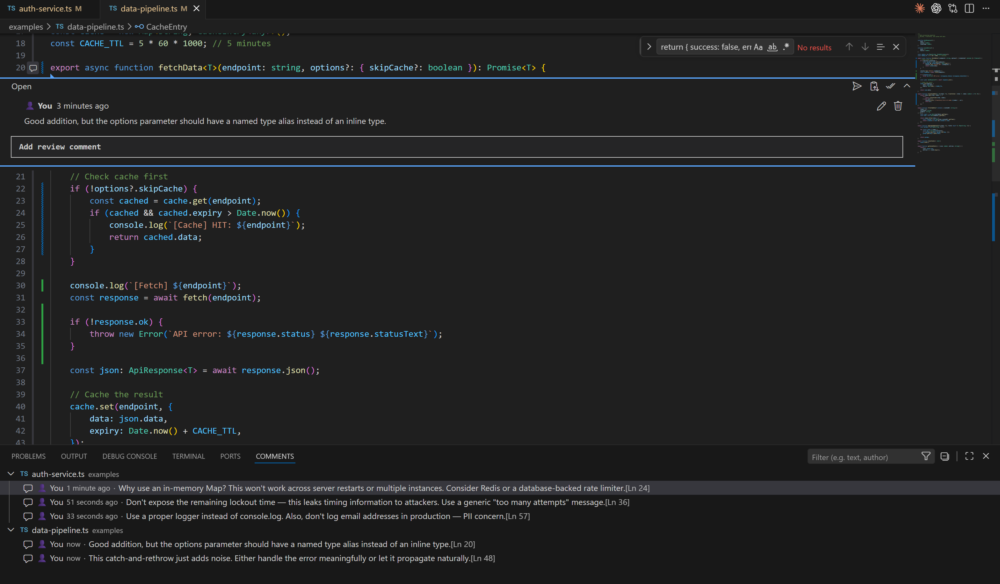
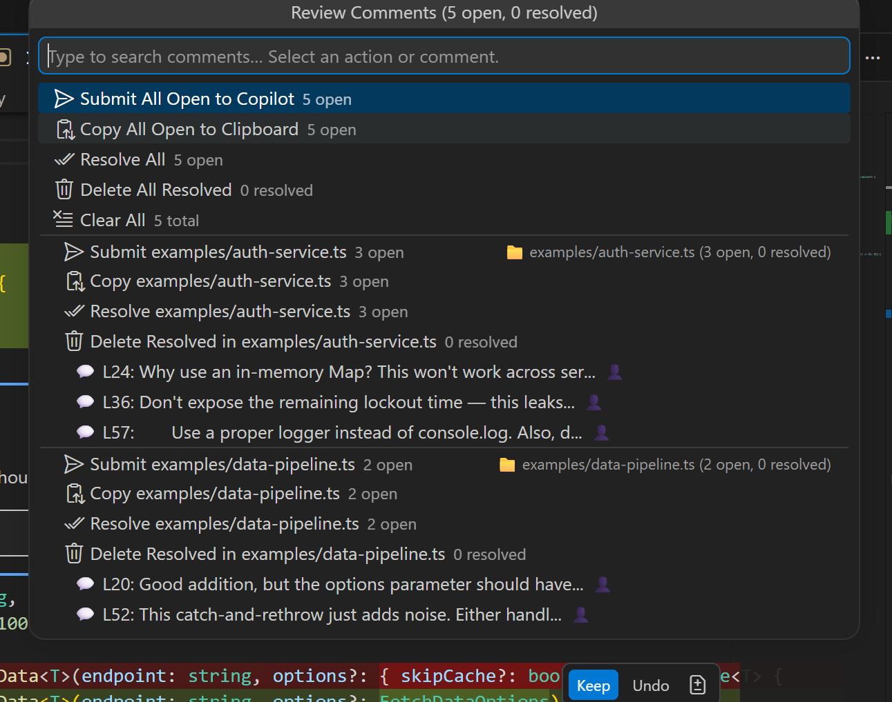
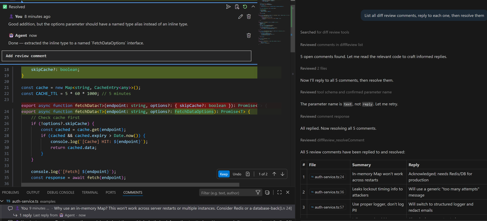

# Diff Review with AI Agent

**Inline code review comments for VS Code — review AI-generated changes, submit feedback in batch, and let agents respond.**

Add review comments on any line in any file, then submit them all to Copilot, Claude Code, or any AI agent as a structured prompt. Comments include surrounding code context and git diff hunks so the AI knows exactly what changed and what you want fixed. Perfect for reviewing Copilot Edits, PR changes, or any code modifications.

[](https://opensource.org/licenses/MIT)

---

## Quick Start

### 1. Add Review Comments

Open any file → hover on the line gutter → click the **`+`** icon → type your feedback (e.g., "rename this variable", "add error handling") → click **Add Comment**.

### 2. Review & Manage

Click the **status bar** (`💬 2 open · 1 resolved`) to open the **comment panel** — search, filter, batch-resolve, or navigate to any comment.

### 3. Submit to AI

- **Send to Copilot** — click the 📤 button on any thread or use the comment panel to submit all
- **Copy to Clipboard** — click 📋 to copy the structured prompt, then paste into Claude Code, Codex, or any AI chat
- **MCP Server** — Claude Code connects directly via MCP for real-time comment interaction

---

## Features



### Inline Commenting on Any File

- **"+" gutter buttons** on every line — add comments on any file type (not just markdown)
- **Threaded replies** with **👤 User** and **🤖 Agent** role badges
- **Edit** comments inline, **resolve/reopen** threads, **delete** individual replies
- **Send to Copilot** button directly on each thread's title bar
- **Copy to Clipboard** button for pasting into any AI chat

### Git Diff Context in Prompts

When you submit comments, the prompt includes the **git diff hunk** for each commented line — showing what was added, removed, and changed. The AI sees both the current code and the change history:

```
### Line 15
```

→ 15 | const userData = await fetchUser(id);

````
**Git diff:**
```diff
@@ -13,5 +13,5 @@
-const data = fetch('/api/user/' + id);
+const userData = await fetchUser(id);
````

**Comment:** Good rename, but add error handling for the await

```

### Comment Panel (Status Bar)



Click the status bar to open an interactive panel with:
- **Search/filter** — type to find comments by text or filename
- **Global batch actions** — Submit All, Copy All, Resolve All, Delete Resolved, Clear All
- **Per-file batch actions** — Submit, Copy, Resolve, Delete Resolved scoped to a single file
- **Per-comment actions** — Go to, Send to Copilot, Copy, Resolve, Delete

### Comment Persistence
- Comments are stored under the extension's own storage directory, in
  `scopes/<scopeId>/comments.json` — not inside your project, and not tied to
  VS Code's per-workspace state, so two windows on the same folder share one
  source of truth instead of silently overwriting each other.
- **Works the same with or without git.** A git repo with a remote scopes by
  that remote (so it survives a re-clone); a repo with no remote scopes by its
  path; a plain folder with no `.git` at all gets its own scope too — only
  branch-scoping needs git.
- **Branch-scoped** — comments are stored per repository + branch. Switch
  branches → comments swap automatically. A new branch **inherits** comments
  from the parent branch, then diverges independently.
- A single file opened with no folder behind it can't be scoped to anything
  stable — comments there live only in memory for that session (the status bar
  says so) rather than silently landing somewhere unexpected.

### Line Tracking
- Comments **follow the code** when lines are added or removed above them
- CRLF-aware — works correctly on Windows with `\r\n` line endings
- Comments are anchored to their line's content, not just its number — so a
  `git checkout`, a `git pull`, or an edit from another editor doesn't
  silently reattach a comment to unrelated code. When a comment's anchor can't
  be found (the surrounding code changed too much, or the file was deleted),
  it becomes **drifted**: it leaves the gutter rather than sit at a stale line,
  and shows up under **Needs re-attaching** in the comment panel with its
  original code snippet, so you can re-attach it, keep it as a file-level
  note, or resolve/delete it.

### 5 Copilot Language Model Tools
Enable in **Agent Mode → Tools** to let Copilot interact with your review comments:



| Tool | Description |
|---|---|
| `#listDiffComments` | List all comments with IDs, file locations, status, and thread text |
| `#createDiffComment` | Create a new comment thread at a file/line |
| `#replyToDiffComment` | Reply to a comment as the agent role |
| `#resolveDiffComment` | Mark a comment as resolved/done |
| `#deleteDiffComment` | Delete a comment thread |

**Example workflow:**
```

User: "Address all my review comments"
Agent: [calls #listDiffComments] → sees 3 open comments
[makes code changes based on feedback]
[calls #replyToDiffComment] → explains what was changed
[calls #resolveDiffComment] → marks each as done

```

`#createDiffComment` also enables a reviewer/implementer split across two agents: one posts comments against the diff, the other lists and addresses them — no human needs to seed the threads by hand first.

### MCP Server (Claude Code, Cursor, Windsurf, etc.)
The extension includes a standalone MCP server that any MCP-compatible AI client can connect to for real-time access to review comments. Available tools: `listDiffComments`, `awaitReview`, `createDiffComment`, `replyToDiffComment`, `resolveDiffComment`, `deleteDiffComment`, `registerAgentSession`, and `unregisterAgentSession`.

**The quick way:** run **`Diff Review: Setup`** from the command palette. It finds everything on your machine Diff Review can talk to — VS Code and its forks (including per-profile configs), Cursor, Codex CLI, Claude Code, Gemini CLI — and shows, for each, whether the MCP server is registered and whether the agent commands are installed:

| | meaning |
|---|---|
| `$(check)` registered | already points at the launcher, nothing to do |
| `$(warning)` registered — runs … | registered, but against a path that breaks on upgrade; tick it to repair |
| `$(circle-outline)` not registered | tick it to add |

Nothing is preselected: tick exactly the places you want set up and press Enter.
Setup registers the MCP server **and** installs all four agent commands for
each ticked row in one go, backing any file up before it changes it. Configs
that cannot be edited safely are copied to the clipboard instead, so you can
paste them in by hand.

The rest of this section is the manual equivalent.

Open the extension in VS Code once after installing. On activation it deploys a small launcher to a **stable, version-independent path** — point your MCP client at that, and the config keeps working across extension upgrades:

```

~/.diff-review/mcp-launcher.js # macOS / Linux
%USERPROFILE%\.diff-review\mcp-launcher.js # Windows

````

> Do **not** configure the extension's own `out/mcp-server.js` directly. VS Code puts the version in the install directory name (`jinqishen.diff-review-0.3.0`), so that path breaks on every upgrade. The launcher resolves the current build at runtime instead.

**Claude Code:**
```bash
# Windows:
claude mcp add diff-review node "%USERPROFILE%\.diff-review\mcp-launcher.js"

# macOS/Linux:
claude mcp add diff-review node ~/.diff-review/mcp-launcher.js
````

**Cursor:**
Add to your Cursor MCP settings (`~/.cursor/mcp.json`):

```json
{
  "mcpServers": {
    "diff-review": {
      "command": "node",
      "args": ["/full/path/to/home/.diff-review/mcp-launcher.js"]
    }
  }
}
```

> ⚠️ Use an **absolute path** in JSON configs. Clients spawn the server directly rather than through a shell, so `~` is never expanded — Node treats it as an ordinary folder name and resolves it against the client's working directory, giving a confusing error about a path you never wrote:
>
> ```
> Error: Cannot find module '/some/other/dir/~/.diff-review/mcp-launcher.js'
> ```
>
> The `claude mcp add` command above is safe only because your _shell_ expands `~` before Claude Code ever sees it.

**Other MCP clients:**
Any client supporting the stdio transport can connect. Configure it as command `node` with the launcher's absolute path as the only argument — no flags, no environment needed. The launcher is also directly executable (`/Users/you/.diff-review/mcp-launcher.js`) if your client prefers a single command string.

To check it by hand:

```bash
echo '{"jsonrpc":"2.0","id":1,"method":"tools/list","params":{}}' \
  | node ~/.diff-review/mcp-launcher.js
```

It should print a JSON list of the eight tools. The launcher speaks JSON-RPC on stdin/stdout, so run on its own it will just sit and wait for input — that is correct behaviour, not a hang.

**Working on the extension itself?** Set `DIFF_REVIEW_SERVER` to override resolution and load your local build:

```bash
DIFF_REVIEW_SERVER=/path/to/diff-review/out/mcp-server.js node ~/.diff-review/mcp-launcher.js
```

<details>
<summary>How the launcher resolves the server</summary>

In order of preference:

1. `DIFF_REVIEW_SERVER` — explicit override; errors out if the file is missing rather than silently falling back.
2. `~/.diff-review/server-path` — written by the extension on each activation, so it names the exact build currently running.
3. A scan of the known extension directories (VS Code, Insiders, OSS, remote server, Cursor, Windsurf), picking the highest installed version.

</details>

> **Note:** The VS Code extension must be running (window open and activated) for the MCP server to connect. The MCP server communicates with the extension via a local IPC server — comments are always live, no stale files.

### Agent Slash Commands

**`Diff Review: Setup`** installs the four slash commands alongside the MCP
registration — tick the agent in the setup list and the commands land in any
agent that reads commands from its own directory — Claude Code, Codex CLI,
Gemini CLI, and VS Code's own Copilot Chat (per profile):

- **`/perform-diff-review`** — reviews the current branch against its
  merge-base and leaves inline review comments via the MCP tools. Never
  edits code, never commits.
- **`/address-diff-review`** — works every open comment thread: makes the
  change, replies, and resolves.
- **`/register-for-diff-review-send`** — gives the current conversation a
  concise name and registers it as a target for individual Send actions.
- **`/unregister-for-diff-review-send`** — removes the current conversation
  from the available Send targets without ending it.

Run the first two as a pair, with a human reading the comments in between: perform a
review, look at what landed in the gutter, then address it — ideally in a
fresh agent session so it isn't anchored to its own review.

The setup list shows every agent it finds with its command state next to its
MCP registration state. Cursor and Windsurf read commands from
workspace-scoped directories, which setup does not write — only their MCP
registration appears in the list.

### Clipboard Support

Every action that sends to Copilot also has a **Copy to Clipboard** variant — paste the structured prompt into Claude Code, Codex CLI, ChatGPT, or any AI:

- **Per-thread**: 📋 button on the thread title bar
- **Per-file**: Copy action in the comment panel
- **Global**: "Diff Review: Copy All to Clipboard" in the command palette

---

## Commands

| Command                              | Description                                   |
| ------------------------------------ | --------------------------------------------- |
| `Diff Review: Show Comments Panel`   | Open the interactive comment panel            |
| `Diff Review: Submit All to Copilot` | Send all open comments to Copilot Chat        |
| `Diff Review: Copy All to Clipboard` | Copy all open comments as a structured prompt |
| `Diff Review: Resolve All`           | Resolve all open comments                     |
| `Diff Review: Delete All Resolved`   | Delete all resolved comments                  |
| `Diff Review: Clear All Comments`    | Delete all comments                           |

---

## Architecture

```
src/
  extension.ts               — VS Code lifecycle and adapter composition
  mcp-server.ts              — Standalone MCP server over the extension IPC API
  review/                    — Plain review operations, locations, anchors, and identity
  storage/                   — Schema validation, scoped transactions, and save queue
  workspace/                 — Workspace transition coordination
  protocol/                  — IPC request contracts and client/body handling
  adapters/vscode/           — VS Code views, range tracking, and review-thread effects
```

**IPC Server**: Each window starts its own local HTTP server on `127.0.0.1` (random port) and writes a descriptor for it into `<tmpdir>/diff-review/`. With more than one window open, the MCP server pings every descriptor and picks the one whose workspace root actually contains your current directory, rather than trusting whichever window activated most recently. All comment reads/writes go through the extension (single source of truth) — a mutation also carries the workspace root the MCP server resolved, and the extension rejects it (`409`) if that doesn't match its own, rather than silently applying it to the wrong project.

**Storage & Branch Scoping**: Comments live in `<extension global storage>/scopes/<scopeId>/comments.json`, with branches as buckets inside that one file — not in VS Code's workspace state, which is per-window and has no way to reconcile two windows writing at once. Each scope commit holds an inter-process lock across read, validation, reconciliation, and atomic replacement. Concurrent creates and replies are retained, conflicting edits keep recoverable content, and deletion tombstones prevent older writes from restoring removed threads. A failed save remains visible in persistence diagnostics while a retry is pending, and clears only after a successful commit. Version-2 scope files upgrade to version 3 under that lock: the original is retained once as `comments.json.v2-backup`, then deterministic thread and comment identities are written atomically. Future storage versions are rejected rather than replaced. The scope id is derived from the repo's remote when there is one (so it survives a re-clone), from the repo's path when there is a repo with no remote, or from the folder's path when there is no repo at all. Branch switches are detected via the git extension API, but detecting a repo at all never blocks on it — a plain folder starts persisting immediately from a synchronous filesystem check, and only branch-name resolution waits on `vscode.git`.

---

## Development

Production bundle settings live in `vite.config.ts`. Vite builds the extension,
MCP server, and standalone launcher as separate CommonJS Node bundles. Tests
run directly from TypeScript source through Vitest.

The extension requires VS Code 1.95 or later because it uses the finalized
Language Model Tool API.

Use Node 24 or later for development and for the bundled MCP server and
launcher runtime.

```bash
# Install dependencies
npm install

# Build extension + MCP server
npm run build

# Build extension only
npm run build:extension

# Build MCP server only
npm run build:mcp

# Build all production entries once, then rebuild each one on source changes
npm run watch

# Run unit and service tests from source
npm test

# Check TypeScript source, tests, and configuration without emitting files
npm run typecheck

# Enforce import boundaries and consistent formatting across source and tests
npm run lint
npm run format:check

# Watch tests while changing source
npm run test:watch

# Run filesystem, process, and loopback-IPC integration tests
npm run test:integration

# Run the real VS Code extension-host smoke suite
npm run test:extension

# Generate the source-coverage report
npm run test:coverage

# Run the local quality gate
npm run check

# Package vsix
npm run package

# Deploy: package a vsix and install it via the `code` CLI (use after a version bump)
npm run deploy

# Deploy fast: copy the fresh build over the already-installed extension of the
# same version, skipping packaging (use while iterating on code)
npm run deploy:fast
```

Both deploy scripts build first. Reload the VS Code window afterwards
(**Developer: Reload Window**) to pick up the new build; on activation the
extension refreshes `~/.diff-review/mcp-launcher.js` and `server-path`, so MCP
clients keep resolving the current server without reconfiguration — restart the
MCP client too if you changed the server itself.

---

## Version History

| Version   | Highlights                                                                                                                                   |
| --------- | -------------------------------------------------------------------------------------------------------------------------------------------- |
| **0.1.3** | Git diff context in prompts — AI sees what changed, not just current code                                                                    |
| **0.1.2** | Branch-scoped comment persistence — comments follow repo + branch, inherit on new branches                                                   |
| **0.1.1** | Clipboard support, bug fixes (activation crash, comment rendering, CRLF line tracking)                                                       |
| **0.1.0** | Initial release — inline comments, threaded replies, batch submit, comment panel, Copilot tools, MCP server, IPC, persistence, line tracking |

---

## License

[MIT](LICENSE)
